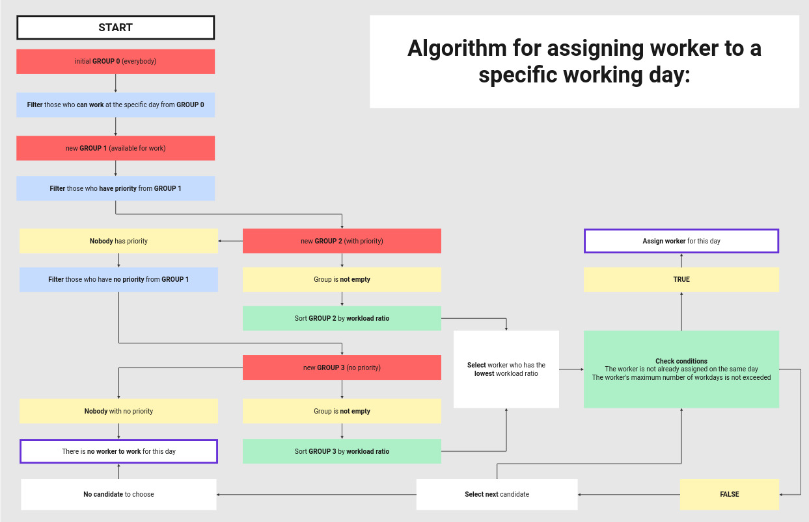

# scheduler
Scheduler is a tool for generating work schedules based on employee availability and work limits.<br>
## Worker Assignment Algorithm
<br>
## Installation
Clone the repository:
```
git clone git@github.com:ylam21/scheduler.git scheduler
```
```
cd scheduler
```
<br>
## Configuration
Set employee names, their availability and limits in:
`./config/users.c`<br>
Availability Values:
- 0 = Not available
- 1 = Available
- 2 = Available with priority<br>
Work Limits:
- index 0 = Minimum workdays
- index 1 = Maximum workdays
- index 2 = Exact number of workdays
- value '-1' = No restriction<br>
Set the maximum consecutive workdays in:
`./include/user.h`<br>
## Usage
Compile and run:
```
make && ./bin
```
